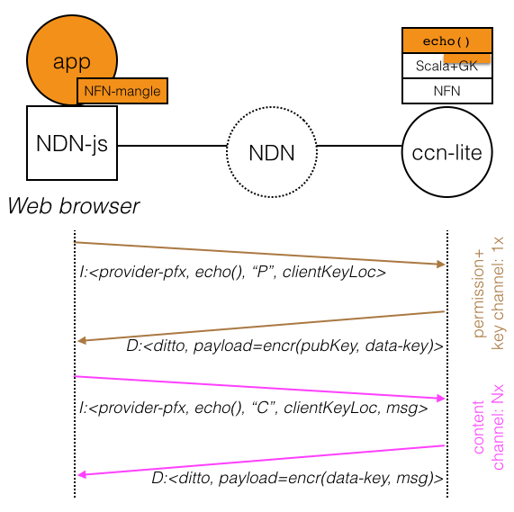

# Access control for NDN with NFN

This projects adds an access control system to NDN that permits to
hand out individual decryption keys to clients.

## First phase (Saturday): Access control for echo() service

Goal: To let an app written in NDN-js (client) request a decryption
key for a specific named service, in this case a simple echo, and then
invoke that service.

Achievement of Saturday: Everybody is on the same page, agreement on
implementation plan and division of labor. Summary of the design:

We align with Marxer's schema and the three "channels" needed for
access control: permission granting channel, key provisioning channel,
content channel. However, we simplify the "security dance" and combine
permission and key channel.

In a first phase, the permission granting and key creating entity
(gatekeeper) is co-located with the content generating entity. This
permits to share the generated content encryption keys via the local
file system.

System Architecture:

Mangled name format for requesting permission and retrieving the decryption key:

~~~
I: /service-provider-prefix/echo/p/<keyname>/NFN
D: /service-provider-prefix/echo/p/<keyname>/NFN
   payload = base64(asymencr(pubkey_keyname, encryptionKey))
~~~

Mangled name format for requesting service invocation:

~~~
I: /service-provider-prefix/echo/c/<keyname, msg>/NFN
D: /service-provider-prefix/echo/c/<keyname, msg>/NFN
   payload = symencr(encryptionKey, msg))
~~~

Discussion:

Shouldn't the "p" and "c" component come before the service name? Like in

~~~
I: /service-provider-prefix/c/echo/<params>/NFN
  or
I: /service-provider-prefix/c/lambda/<expr>/NFN
  or
I: /service-provider-prefix/c/datalog/<expr>/NFN
  etc
~~~

## Second phase (to be discussed Sunday)

Candidate targets:

~~~
  implement a content-specific access rules e.g., threshold (which cannot be expressed at the name level)
  store data-decryption keys in the NDN memory fabric. This has the benefit that content access is possible even if the gatekeeper crashes and cannot remember the assigned data decryption key.
~~~

## Demos

Candidate targets:

~~~
  demonstrate access-controlled execution of lambda reduction
  demonstrate chaining of access-controlled data filtering
  demonstrate mapping of access control to database query rights
~~~

## Lessons learned

- use the Gatekeeper protocol to secure access to NFN

----

